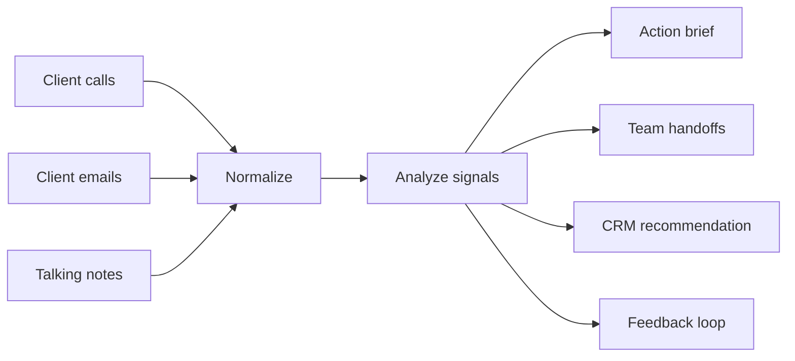

# Client Communications To CRM Public Showcase

This repo is a sanitized public mirror of a private AI workflow. It preserves the real workflow shape, data mapping, handoff logic, CRM recommendation pattern, and implementation lessons while replacing private client data, credentials, schemas, transcripts, and customer details with safe examples.

## What This Demonstrates

- Turning client calls, emails, and meeting notes into action-ready operating notes.
- Extracting client asks, blockers, buying signals, and feedback loops.
- Routing next steps to sales, marketing, engineering, and customer success.
- Recommending CRM status changes with evidence and a write boundary.
- Keeping human review visible before any CRM mutation.

## Workflow

1. **Intake:** collect call summaries, client emails, and internal talking notes.
2. **Normalization:** reduce each source into a shared public-safe record.
3. **Signal extraction:** identify pricing/proposal asks, technical blockers, proof needs, onboarding feedback, and launch/messaging needs.
4. **Actioning:** create next steps with owner-team routing.
5. **CRM recommendation:** suggest status changes and field updates without writing directly by default.
6. **Feedback loop:** capture repeated client friction as future qualification, onboarding, or handoff improvements.

## Why This Matters

Client communication usually creates operational drift: one person hears a blocker, another owns the next step, a CRM stage gets stale, and feedback never becomes process improvement. This sample shows how AI can sit between messy communication and the operating system of the business.

The goal is not to replace judgment. The goal is to make the judgment inspectable:

- What did the client actually say?
- What should happen next?
- Who owns it?
- What CRM status or field should change?
- What did we learn for the next client?

## Architecture



## Run It

```bash
python3 -m pytest
python3 -m src.client_ops.cli --mode brief
python3 -m src.client_ops.cli --mode crm
```

## Repo Structure

- `src/client_ops/`: sanitized implementation.
- `tests/`: behavior tests for normalization, signal extraction, handoffs, and rendering.
- `examples/`: fake client inputs and generated outputs.
- `docs/`: architecture, sanitization notes, and reviewer guide.

## How A CTO Or Engineer Should Review This

The main question is whether the mapping makes sense:

- Can a terminal run take fake communication records and produce deterministic action notes?
- Are inputs normalized before analysis?
- Are CRM changes recommendations with evidence, not blind writes?
- Are team handoffs explicit enough for sales, marketing, engineering, and customer success?
- Is the feedback loop real, or just a summary?

This sample is intentionally small. It is meant to show how the system is built and how AI-assisted operations work, without exposing private company data or overcomplicating the public fork.

## What Was Sanitized

- No real client names.
- No real companies.
- No real call transcripts.
- No real emails.
- No real CRM field IDs.
- No API keys, tokens, webhook URLs, or workspace IDs.

See `docs/sanitization-notes.md` for the full release boundary.

