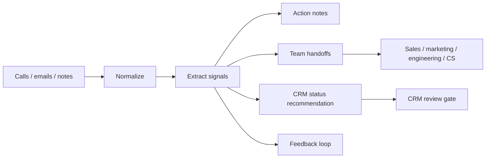

# Architecture

This public mirror shows a client-communication operations loop:

1. Ingest calls, emails, and meeting notes.
2. Normalize each source into a shared communication record.
3. Extract client signals, blockers, asks, and feedback.
4. Convert signals into action notes and owner-team handoffs.
5. Recommend CRM status changes without writing directly by default.
6. Capture recurring feedback as process improvements.

The private version can be wired to Slack, Gmail, call transcripts, Notion, Airtable, Attio, Salesforce, HubSpot, or another CRM. This public version keeps the same mapping logic but uses local JSON and Markdown so reviewers can inspect the behavior without credentials.

## Data Flow

## Write Boundary

The demo uses `recommendation_only` CRM write mode. That means the system can say what should change, why, and which evidence supports it, but it does not mutate CRM state without a later approved writer.

